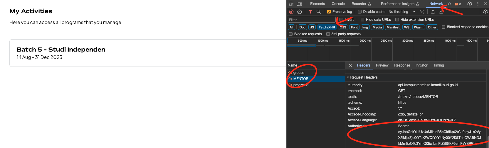
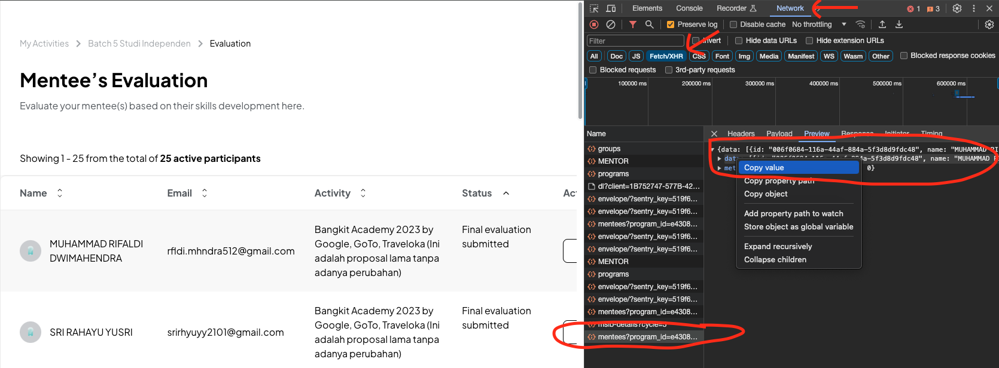

# Bangkit Mentees Submission

## Tutorial

### 1. Project Setup

1. Install NodeJS latest version [here](https://nodejs.org/en)
2. Run `npm install` to install all dependencies

### 2. Data Preparation

1. Open the `Final_Evaluation_Interface_ML-04.xlsx` file
2. Fill the `Final_Evaluation_Interface_ML-04.xlsx` in `Original` sheet with your data
3. Replace or reuse the `Machine Learning Comment` sheet with your data
4. Save the `Machine Learning Comment` sheet as `Machine Learning Comment.csv`
5. Save the `Original` sheet as `Original.csv`
6. Open the converter [here](https://csvjson.com/csv2json)
7. Upload the `Machine Learning Comment.csv` and `Original.csv` to the converter and convert it to JSON
8. Copy the JSON result to each files named `original.json` and `comments.json`
9. Open `assessment.js` and change the `keys` variable by matching it with the `comments.json`

### 3. Get Mentee Token

1. Go to website <https://mentor.kampusmerdeka.kemdikbud.go.id/dashboard>
2. Login with your account
3. On the dashboard page, press f12 (Inspect Element) and get the token by follow this image below 
4. Copy the token to your clipboard (Without `Bearer`)
5. Paste the token to `assessment.js` on the `token` variable

### 4. Get Users Data

1. Go to evaluation page at <https://mentor.kampusmerdeka.kemdikbud.go.id/dashboard/log/evaluation/5>
2. Press f12 (Inspect Element) and get the users data by follow this image below 
3. Copy the users data to your clipboard by click the data response (Copy Value)
4. Paste the users data to `users.json`

### 5. Get Request Data

1. Go to evaluation page for 1 student
2. Press f12 (Inspect Element) and open the network tab
3. Go to `Final Evaluation` tab and click `Save Draft` button
4. Get the request data with title `final_assessment` with `POST` method, copy the request data
5. Paste the request data to `request.json`

### 6. Run the Program

1. Run `npm start` to start the program

## Notes

- Make sure to check the course title on the `final evaluation` tab is same with the variable `Course List` on the `comments.json` file. These may cause the comments are not submitted on specific course list.
